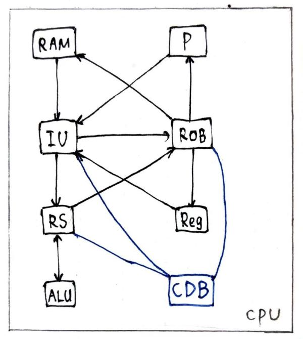

### RISC-V simulator

------

#### Tomasulo 算法

#### 主体逻辑说明

**发射(Issue|Instruction Unit)**

在issue未stall/halt（halt时检查jalrBus是否在广播）且ROB未满的情况下，由Instruction Unit从RAM中读取指令并调用Decoder解码，向ROB申请新位置。

若为REG/MEM类指令，修改可能需要的RegisterFile的dependency（要在RSEntry读取之后，防止a=a+1的错误），新建RSEntry并发射到RS上（特殊指令可能不需要）；若为BRANCH指令，新建RSEntry把计算任务发射到RS上，预测更新pc（其他指令也要正常更新pc）；读到END指令时，将其直接发射到ROB上并stall issue。

特别的，对于jalr指令，向RS发射pc计算任务，在ROB上添加reg修改指令并halt issue，等到RS计算完成传到ROB后，检查opt为jalr再重启issue并更新pc（专门开一条信道jalrBus从ROB传回IU，此时不需要更改ROBvalue，但要把状态改成ready）。这里我们认为pc+4是可以直接得到的（可以在硬件上专门设计一个组合逻辑电路），因此jal指令其实可以不进入RS而直接ready。

在发射到RS的过程中，如果发现RS已满，则暂停等待，pop新申请的ROBEntry。

**执行(Execute|Reversed Station)**

检查所有unempty的entry，如果unready就检查接收ROB的CDB（ready本质上是一个Q1&Q2的组合逻辑电路）；如果ready但unbusy就把它推入ALU计算（busy = true）；如果ready and busy意味着计算完成，将计算结果（模拟中真正调用ALU）广播，更新ROB上的value&ready以及可能的predict，并对寄存器类指令修改RS里所有的dependency，特别的，如果是jalr指令，更新ROB的ready并在jalrBus上广播。

**提交(Commit|Reorder Buffer)**

每次try commit队头最早的指令，

若predict_accuracy = false（此时应该已经ready），全局报错（广播predictBus**并立刻刷新**），在当前周期结束flush时清空RS&ROB以及Register的dependency（其实是清空并刷新），修改pc为正确分支，重新开始（注意如果此时若issue halt/stall则要reset）；

若ready = false，return等待ready；若ready = true但LS不为0，LS减1，对于Load操作，若现在truly ready，则**立刻执行访存操作**；

若ready = true&&LS = 0，正式提交，真实修改Register File或RAM（若是修改Reg还要CDB广播），指令出队，若为HALT指令则修改全局变量结束程序。
